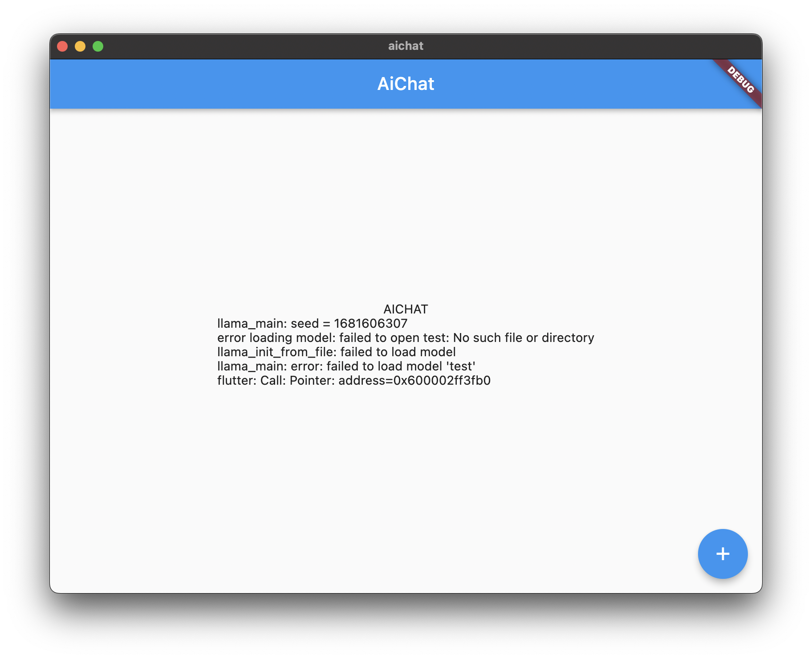

# AiChat - LLaMA - Flutter

This project is a simple test to use `llama.cpp` on mobile.

Use `LLaMA Mobile` fork patched instead of official `llama.cpp` with command:

```
git clone https://github.com/paulocoutinhox/llama.cpp.git -b "mobile"
```

## Build for macOS

On LLaMA Mobile execute the command:

```
./scripts/build-macos.sh
```

Copy the generated library to correct place. Example:

```
mkdir ~/Developer/workspaces/flutter/llama-flutter/macos/Vendor
cp build/examples/main/Release/libmain.dylib ~/Developer/workspaces/flutter/llama-flutter/macos/Vendor/libmain.dylib
```

And run with:

```
flutter run -d macos
```

## Screenshot


